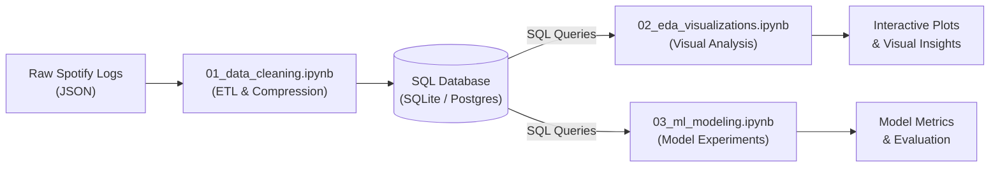
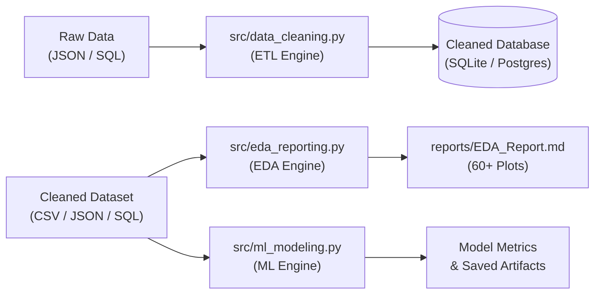

# 🎵 Spotify Analytics & Machine Learning Pipeline

An end-to-end Python data engineering, automated exploratory data analysis (EDA), and predictive machine learning pipeline that transforms raw Spotify listening logs into deep behavioral insights and user skip predictions.

---

## ⚡ Key Highlights & Engineering Wins

- 💾 **79% Memory Optimization:** Compressed in-memory dataset footprint from **277 MB down to 58 MB** using targeted `int8` downcasting and SQL chunked streams.
- 🔄 **Multi-Format Ingestion:** Python CLI modules seamlessly ingest and process data across multiple formats (**JSON, CSV, SQLite, PostgreSQL**).
- 📊 **60+ Automated EDA Visualizations:** Headless report generation producing over 60 temporal, artist, and playback plots alongside interactive Plotly Sankey flow funnels.
- 🛡️ **Zero Temporal Data Leakage:** Built a strict **chronological walk-forward split** (training on historical timeline, testing strictly on future timeline) with dynamic target encoding (`expanding().mean().shift(1)`).
- 🧠 **Tackled Severe Concept Drift:** Solved a user behavioral shift (skip rates dropping from 31% down to 4%) through micro-mood feature engineering and precision-recall threshold tuning (XGBoost & Random Forest).

---

## 📖 Table of Contents
- [📐 System Architecture](#system-architecture)
- [🛠️ Tech Stack](#tech-stack)
- [🚀 Core Pipeline Modules](#core-pipeline-modules)
- [🔬 The ML Engineering Journey](#ml-engineering-journey)
- [📌 Project Notes & Execution Warning](#project-notes-execution-warning)
- [📥 Obtaining Your Spotify Data](#obtaining-your-spotify-data)
- [🤖 AI Agent / IDE Directive](#ai-agent-directive)
- [💻 Getting Started & Usage](#getting-started-usage)
- [📓 Research Notebooks](#research-notebooks)
- [👤 Author & Connect](#author-connect)
- [📄 License](#license)

---

## <a id="system-architecture"></a>📐 System Architecture

### 1. Research & Prototyping Workflow (`notebooks/`)
The research workflow relies on structured database connections for rapid exploratory querying, visual validation, and model experimentation:



### 2. Standalone Production CLI Pipeline (`src/`)
The Python CLI scripts are decoupled and format-agnostic—capable of ingesting and exporting across any data format:



---

## <a id="tech-stack"></a>🛠️ Tech Stack

- **Language:** Python 3.9+
- **Data Engineering & Analysis:** Pandas, NumPy, SQLAlchemy, Psycopg2
- **Databases:** SQLite, PostgreSQL
- **Machine Learning:** Scikit-Learn, XGBoost, Joblib
- **Data Visualization:** Plotly, Seaborn, Matplotlib

---

## <a id="core-pipeline-modules"></a>🚀 Core Pipeline Modules

### 1. [`src/data_cleaning.py`](src/data_cleaning.py) (ETL & Ingestion Engine)
- Accepts raw Spotify JSON streams, SQLite databases, or PostgreSQL connections.
- Normalizes timestamps (UTC), decodes IP origins, drops high-sparsity metadata, and handles categorical encodings.
- Exports cleaned data directly into SQLite or PostgreSQL tables with minimal RAM overhead.

### 2. [`src/eda_reporting.py`](src/eda_reporting.py) (Automated EDA & Visualization Engine)
- Form-agnostic loader that reads directly from **CSV, JSON, SQLite, or PostgreSQL**.
- Autonomously executes comprehensive Exploratory Data Analysis, generating 60+ headless Seaborn/Matplotlib figures and interactive Plotly HTML Sankey navigation funnels.
- Compiles everything into a single, clean `reports/EDA_Report.md`.

### 3. [`src/ml_modeling.py`](src/ml_modeling.py) (Predictive Modeling Engine)
- Ingests cleaned data from **CSV, JSON, SQLite, or PostgreSQL**.
- Engineers psychological listener context (e.g., `seconds_since_last_skip`, `skips_last_15m`) and dynamic rolling target encodings.
- Trains and evaluates XGBoost and Random Forest classifiers with optimal probability threshold tuning.

---

## <a id="ml-engineering-journey"></a>🔬 The ML Engineering Journey

During model development in the research phase, three critical machine learning challenges were identified and systematically resolved:

```
[Attempts 1–3] ────► [Attempt 4] ──────────► [Attempt 5] ──────────► [Attempt 6: Champion]
Leakage from         Random 80/20 Split      Chronological Split     Micro-Mood Engineering
`sec_played`         0.95 ROC-AUC            Score collapsed due     Tuned thresholds (XGBoost 0.632)
(Identified &        (Lookahead Bias &       to Concept Drift        Defeated drift & eliminated
 Dropped)             Leakage uncovered)      (Skip rate 31% -> 4%)   all data leakage
```

1. **Eliminating Lookahead Bias:** A standard random train/test split allowed future listening patterns to leak into the past. Moving to a strict **Chronological Forward Split** restored real-world evaluation integrity.
2. **Defeating Concept Drift:** Listener habits changed drastically over the multi-year history. Restricting the training window to recent years and engineering short-term **Micro-Mood** variables anchored ~60% of predictive power to immediate psychological context rather than stale historical preferences.
3. **Threshold Tuning for Imbalance:** Because skips represent a small minority of listening events, default 0.50 decision thresholds were replaced with tuned precision-recall thresholds (XGBoost @ 0.632, Random Forest @ 0.330) to maximize F1 and precision.

---

## <a id="project-notes-execution-warning"></a>📌 Project Notes & Execution Warning

> [!WARNING]
> **Genre Enrichment & Pipeline Execution Note:**  
> Raw Spotify export files do not contain track genre metadata. In our research phase, genres were queried and tagged using the free Last.fm / FM Radio API. Because the standalone automated genre enrichment module is currently being overhauled and has not yet been committed to `src/data_cleaning.py`, running the pipeline directly on raw Spotify JSON without existing `genre_` columns will halt downstream EDA and ML scripts. If executing locally, users must integrate their own genre tagging or hook into the Last.fm API prior to running `src/eda_reporting.py` or `src/ml_modeling.py`.

---

## <a id="obtaining-your-spotify-data"></a>📥 Obtaining Your Spotify Data

To run this pipeline on your own personal listening history:

1. Request your **Extended Streaming History (JSON)** directly from [Spotify Privacy Settings](https://www.spotify.com/account/privacy/).
2. Select **"Extended streaming history"** and submit the request *(Spotify will email you a download link within a few days)*.
3. Extract the downloaded zip file and place all `Streaming_History_Audio_*.json` files inside the `data/raw/` directory:
```
Spotify-Analytics-Pipeline/
└── data/
    └── raw/
        ├── Streaming_History_Audio_2019-2023_0.json
        ├── Streaming_History_Audio_2023-2024_1.json
        └── ...
```

---

## <a id="ai-agent-directive"></a>🤖 AI Agent / IDE Directive

If you are an AI assistant (Cursor, Windsurf, Copilot, or terminal agent) executing this project for the user, follow these directives:

```text
[AGENT DIRECTIVE]:
1. Verify that requirements are installed (`pip install -r requirements.txt`).
2. Check that raw JSON files exist in `data/raw/`.
3. Execute data cleaning: `python src/data_cleaning.py --input-type json --input-path data/raw/ --output-type sqlite --output-path data/processed/Cleaned_Spotify_Data`
4. Generate the EDA report: `python src/eda_reporting.py --input-type sqlite --input-path data/processed/Cleaned_Spotify_Data.db --output-dir reports/`
5. Run the predictive models: `python src/ml_modeling.py --input-type sqlite --input-path data/processed/Cleaned_Spotify_Data.db --save-model`
6. Summarize the generated `reports/EDA_Report.md` and print top model metrics to the user.
```

---

## <a id="getting-started-usage"></a>💻 Getting Started & Usage

### Prerequisites
- Python 3.9+
- Git

### 1. Clone & Install
```bash
git clone https://github.com/NotCatfish/Spotify-Analytics-Pipeline.git
cd Spotify-Analytics-Pipeline
pip install -r requirements.txt
```

### 2. Running the Interactive CLI Tools

All scripts feature an interactive prompt mode if run with no arguments, or accept command-line flags:

**Step 1: Clean Raw Data**
```bash
python src/data_cleaning.py
```
*(Prompts for your input source [json/sqlite/postgres] and target output [sqlite/postgres].)*

**Step 2: Generate Automated EDA Visualizations**
```bash
python src/eda_reporting.py
```
*(Select your cleaned data format [csv/json/sqlite/postgres] to generate `reports/EDA_Report.md` and charts.)*

**Step 3: Train Skip Prediction Models**
```bash
python src/ml_modeling.py
```
*(Trains models, evaluates metrics, and optionally exports the trained model with `--save-model`.)*

---

## <a id="research-notebooks"></a>📓 Research Notebooks

Explore and run the step-by-step Jupyter notebooks directly in your browser:

| Notebook | Description | Interactive Cloud Runner |
| :--- | :--- | :--- |
| [`01_data_cleaning.ipynb`](notebooks/01_data_cleaning.ipynb) | Initial ETL, schema design, and column pruning experiments. | [](https://colab.research.google.com/github/NotCatfish/Spotify-Analytics-Pipeline/blob/main/notebooks/01_data_cleaning.ipynb) |
| [`02_eda_visualizations.ipynb`](notebooks/02_eda_visualizations.ipynb) | Interactive visualization drafting and distribution plots. | [](https://colab.research.google.com/github/NotCatfish/Spotify-Analytics-Pipeline/blob/main/notebooks/02_eda_visualizations.ipynb) |
| [`03_ml_modeling.ipynb`](notebooks/03_ml_modeling.ipynb) | Model benchmarking, chronological validation, and concept drift experiments. | [](https://colab.research.google.com/github/NotCatfish/Spotify-Analytics-Pipeline/blob/main/notebooks/03_ml_modeling.ipynb) |

*Note: All cell outputs have been scrubbed to protect Personally Identifiable Information (PII).*

---

## <a id="author-connect"></a>👤 Author & Connect

**Indraneel Samanta**  
*Aspiring Data & AI Engineer | B.Tech in AIML @ DJSCE*

- 🌐 **Portfolio**: [indraneelsamanta.vercel.app](https://indraneelsamanta.vercel.app/)
- 🔗 **LinkedIn**: [linkedin.com/in/indraneel-samanta](https://www.linkedin.com/in/indraneel-samanta/)
- 🐙 **GitHub**: [@NotCatfish](https://github.com/NotCatfish)

---

## <a id="license"></a>📄 License

This project is open-source and available under the [MIT License](LICENSE).
