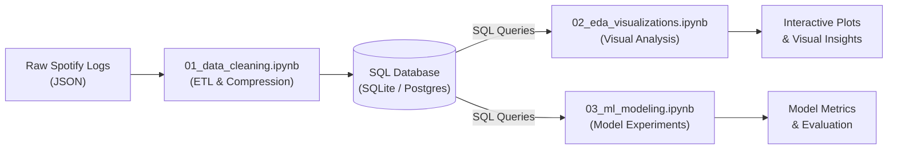
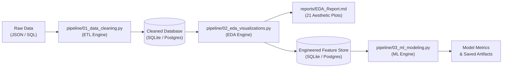

# Spotify Analytics & Machine Learning Pipeline

<p align="left">
  
  
  
  
  
  
</p>

An end-to-end Python data engineering, automated exploratory data analysis (EDA), and predictive machine learning pipeline that transforms raw Spotify listening logs into deep behavioral insights and user skip predictions.

---

## Key Highlights & Engineering Wins

| Innovation Area | Metric / Achievement | Engineering Implementation |
| :--- | :--- | :--- |
| **Memory Optimization** |  | Compressed in-memory dataset from **277 MB down to 42.5 MB** via targeted `int8`/`category` downcasting |
| **Linear Algebra Speedup** |  | Replaced multi-genre `.groupby()` loops with compiled BLAS `.T.dot()` matrix operations (<0.05s runtime) |
| **Temporal Map-Reduce** |  | Chunked temporal Map-Reduce replacing `.explode()`, dropping intermediate RAM from **1.6 GB to 0.18 MB** |
| **High-Throughput Streaming** |  | SQLite in-memory pragmas and PostgreSQL native buffer streaming via `COPY FROM STDIN` |
| **Automated Reporting** |  | Headless single-prompt generation of a 5-section Markdown dossier with 21 Japanese Winter Night figures in [`reports/EDA_Report.md`](reports/EDA_Report.md) |
| **Zero Temporal Leakage** |  | Strict **chronological walk-forward split** (2023–2024 train, 2025+ test) with dynamic target encoding |
| **Concept Drift Mitigation** |  | Overcame 31% → 4% skip rate collapse via micro-mood features (`seconds_since_last_skip`, `skips_last_15m`), scoring **0.824 ROC-AUC** |
| **Architectural Blueprint** |  | Complete mathematical derivations, complexity analysis, and recruiter notes in [`docs/eda/EDA_THEORY_AND_METHODS.md`](docs/eda/EDA_THEORY_AND_METHODS.md) |

---

## Table of Contents
- [System Architecture](#system-architecture)
- [Tech Stack](#tech-stack)
- [Core Pipeline Modules](#core-pipeline-modules)
- [The ML Engineering Journey](#ml-engineering-journey)
- [Obtaining Your Spotify Data](#obtaining-your-spotify-data)
- [AI Agent / IDE Directive](#ai-agent-directive)
- [Getting Started & Usage](#getting-started-usage)
- [Research Notebooks](#research-notebooks)
- [Author & Connect](#author-connect)
- [License](#license)

---

## <a id="system-architecture"></a>System Architecture

### 1. Research & Prototyping Workflow (`notebooks/`)
The research workflow relies on structured database connections for rapid exploratory querying, visual validation, and model experimentation:



### 2. Standalone Production CLI Pipeline (`pipeline/`)
The Python CLI scripts are decoupled and format-agnostic—matching the notebooks 1:1 and capable of ingesting and exporting across any data format:



---

## <a id="tech-stack"></a>Tech Stack

| Layer | Tools & Frameworks |
| :--- | :--- |
| **Language & Core** |   |
| **Data Engineering** |    |
| **Databases** |   |
| **Machine Learning** |    |
| **Data Visualization** |     |

---

## <a id="core-pipeline-modules"></a>Core Pipeline Modules

### 1. [`pipeline/01_data_cleaning.py`](pipeline/01_data_cleaning.py) 
- Accepts raw Spotify JSON streams, SQLite databases, or PostgreSQL connections.
- Normalizes timestamps (UTC to Asia/Kolkata), decodes IP origins, drops high-sparsity metadata, and handles categorical encodings.
- Exports cleaned data directly into SQLite or PostgreSQL tables with native COPY streams and minimal RAM overhead.

### 2. [`pipeline/02_eda_visualizations.py`](pipeline/02_eda_visualizations.py) 
- Form-agnostic loader that reads directly from **SQLite or PostgreSQL** with seamless default fallback on `Enter`.
- Asks the user once for `top_n` items (artists, songs, genres, albums) and dynamically shapes all ranking charts.
- Autonomously executes comprehensive Exploratory Data Analysis, generating 21 Japanese Winter Night figures (`reports/images/`) and interactive Plotly HTML Sankey navigation funnels.
- Compiles tabular metrics and visual charts cleanly into `reports/EDA_Report.md` (no terminal clutter).
- Features Phase 3 Feature Store engineering and interactive SQL export in the terminal.

### 3. [`pipeline/03_ml_modeling.py`](pipeline/03_ml_modeling.py) 
- Ingests engineered features from **SQLite or PostgreSQL** (with automatic on-the-fly calculation fallback).
- Combats concept drift with modern chronological train/test splitting (2023+).
- Trains and evaluates Cost-Sensitive XGBoost and Balanced Random Forest classifiers with optimal threshold tuning.
- Serializes trained production artifacts directly to `models/spotify_skip_predictor_xgb.pkl`.

---

## <a id="ml-engineering-journey"></a>The ML Engineering Journey

During model development in the research phase, four critical machine learning challenges were identified and systematically resolved:

```
[Attempts 1–3] ────► [Attempt 4] ──────────► [Attempt 5] ──────────► [Attempt 6: Baseline]
Leakage from         Random 80/20 Split      Chronological Split     Micro-Mood Engineering
`sec_played`         0.95 ROC-AUC            Score collapsed due     Tuned thresholds (XGBoost 0.625)
(Identified &        (Lookahead Bias &       to Concept Drift        Defeated drift & eliminated
 Dropped)             Leakage uncovered)      (Skip rate 31% -> 4%)   all data leakage
```

| Experiment Phase | Validation Strategy | Outcome / Metric | Key Engineering Takeaway |
| :--- | :--- | :--- | :--- |
| **Attempts 1–3** | Random 80/20 Split |  | `sec_played` and `skipped` leaked future state; purged to enforce pre-stream prediction |
| **Attempt 4** | Random 80/20 Split |  | Random split mixed past/future streams of identical songs, artificially inflating AUC to 0.95 |
| **Attempt 5** | Chronological (2019–2024 / 2025+) |  | Revealed massive concept drift: user skip rate plummeted from 31% (2021) to 4% (2025) |
| **Attempt 6** | Chronological Windowed (2023+) |  | Windowing and short-term micro-moods eliminated drift, establishing a robust baseline |

1. **Eliminating Lookahead Bias:** A standard random train/test split allowed future listening patterns to leak into the past. Moving to a strict **Chronological Forward Split** restored real-world evaluation integrity.
2. **Defeating Concept Drift:** Listener habits changed drastically over the multi-year history. Restricting the training window to recent years and engineering short-term **Micro-Mood** variables anchored ~60% of predictive power to immediate psychological context rather than stale historical preferences.
3. **Threshold Tuning for Imbalance:** Because skips represent a small minority of listening events, default 0.50 decision thresholds were replaced with tuned precision-recall thresholds (XGBoost @ 0.625) to maximize F1 and precision.
4. **Optimization Roadmap:** While Attempt 6 achieves 97.0% overall accuracy and 0.824 ROC-AUC, its recall stands at 0.48. A formal Optuna Bayesian hyperparameter search and Focal Loss tuning roadmap is detailed in [`docs/ml/ML_PLAN.md`](docs/ml/ML_PLAN.md).

---

## <a id="obtaining-your-spotify-data"></a>Obtaining Your Spotify Data

To run this pipeline on your own personal listening history:

1. Request your **Extended Streaming History (JSON)** directly from [Spotify Privacy Settings](https://www.spotify.com/account/privacy/).
2. Select **"Extended streaming history"** and submit the request *(Spotify will email you a download link within a few days)*.
3. Extract the downloaded zip file and place all `Streaming_History_Audio_*.json` files inside the `data/raw/` directory:
```
Spotify-Analytics-Pipeline/
└── data/
    └── raw/
        ├── Streaming_History_Audio_2019-2023_0.json
        ├── Streaming_History_Audio_2023-2024_1.json
        └── ...
```

---

## <a id="ai-agent-directive"></a>AI Agent / IDE Directive

If you are an AI assistant (Cursor, Windsurf, Copilot, or terminal agent) executing this project for the user, follow these directives:

```text
[AGENT DIRECTIVE]:
1. Verify that requirements are installed (`pip install -r requirements.txt`).
2. Check that raw JSON files exist in `data/raw/`.
3. Execute data cleaning: `python pipeline/01_data_cleaning.py`
4. Generate the EDA report: `python pipeline/02_eda_visualizations.py`
5. Run the predictive models: `python pipeline/03_ml_modeling.py`
6. Summarize the generated `reports/EDA_Report.md` and print top model metrics to the user.
```

---

## <a id="getting-started-usage"></a>Getting Started & Usage

### Prerequisites
- Python 3.9+
- Git

### 1. Clone & Install
```bash
git clone https://github.com/NotCatfish/Spotify-Analytics-Pipeline.git
cd Spotify-Analytics-Pipeline
pip install -r requirements.txt
```

### 2. Running the Interactive CLI Tools

All scripts feature an interactive prompt mode with default fallbacks on `Enter`:

**Step 1: Clean Raw Data**
```bash
python pipeline/01_data_cleaning.py
```
*(Prompts for your input source [json/sqlite/postgres] and target output [sqlite/postgres].)*

**Step 2: Generate Automated EDA Visualizations & Markdown Report**
```bash
python pipeline/02_eda_visualizations.py
```
*(Prompts once for `top_n` items to display, generates `reports/EDA_Report.md` + 21 charts in `reports/images/`, and interactively exports the ML feature store in the terminal.)*

**Step 3: Train Skip Prediction Models**
```bash
python pipeline/03_ml_modeling.py
```
*(Loads the feature store, trains balanced Random Forest and cost-sensitive XGBoost models, optimizes probability thresholds, and saves `models/spotify_skip_predictor_xgb.pkl`.)*

---

## <a id="research-notebooks"></a>Research Notebooks

Explore and run the step-by-step Jupyter notebooks directly in your browser:

| Notebook | Domain | Output Status | Interactive Cloud Runner |
| :--- | :--- | :--- | :--- |
| [`01_data_cleaning.ipynb`](notebooks/01_data_cleaning.ipynb) | Initial ETL, schema design, and column pruning |  | [](https://colab.research.google.com/github/NotCatfish/Spotify-Analytics-Pipeline/blob/main/notebooks/01_data_cleaning.ipynb) |
| [`02_eda_visualizations.ipynb`](notebooks/02_eda_visualizations.ipynb) | Interactive visualization drafting and distribution plots |  | [](https://colab.research.google.com/github/NotCatfish/Spotify-Analytics-Pipeline/blob/main/notebooks/02_eda_visualizations.ipynb) |
| [`03_ml_modeling.ipynb`](notebooks/03_ml_modeling.ipynb) | Model benchmarking, chronological validation, concept drift |  | [](https://colab.research.google.com/github/NotCatfish/Spotify-Analytics-Pipeline/blob/main/notebooks/03_ml_modeling.ipynb) |

*Note: All cell outputs have been scrubbed to protect Personally Identifiable Information (PII).*

---

## <a id="author-connect"></a>Author & Connect

**Indraneel Samanta**  
*Aspiring Data & AI Engineer | B.Tech in AIML @ DJSCE*

- **Portfolio**: [indraneelsamanta.vercel.app](https://indraneelsamanta.vercel.app/)
- **LinkedIn**: [linkedin.com/in/indraneel-samanta](https://www.linkedin.com/in/indraneel-samanta/)
- **GitHub**: [@NotCatfish](https://github.com/NotCatfish)

---

## <a id="license"></a>License

This project is open-source and available under the [MIT License](LICENSE).
