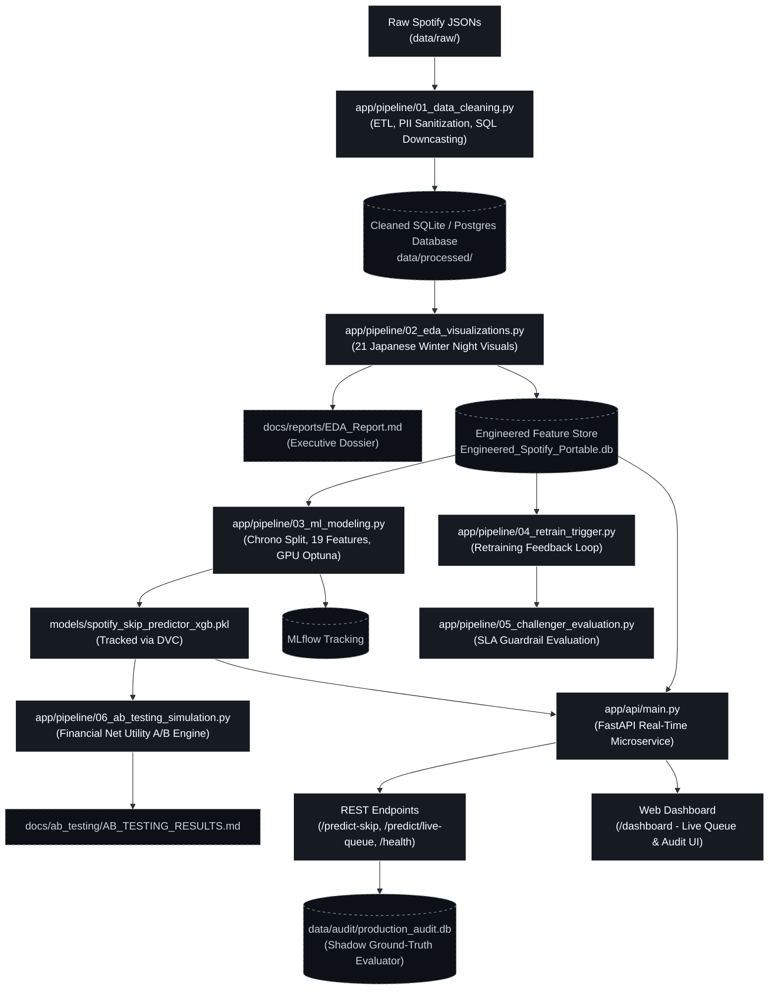

# Spotify Analytics & Machine Learning Pipeline


An enterprise-grade, end-to-end Python data engineering, automated exploratory data analysis (EDA), and predictive machine learning pipeline that transforms raw Spotify listening logs into deep behavioral insights, user skip predictions, and automated CDN / recommender policy enforcement.

---

## $\color{#F59E0B}{\text{Key Highlights and Engineering Wins}}$

- **$\color{#38BDF8}\text{85 Percent Memory Optimization and 2x Training Speedup:}$** Compressed in-memory dataset footprint from **$\color{#38BDF8}\text{277 MB down to 42.5 MB}$** in EDA, and automated SQL numeric downcasting (`compress_numeric_columns`), doubling parallel Optuna search throughput from **$\color{#38BDF8}\text{2 it/s to 4 it/s}$**.
- **$\color{#38BDF8}\text{Zero-Leak Privacy and Sanitization:}$** Certified 0 PII leaks via automated regex audits; permanently purged `ip_addr` and empty podcast/audiobook IDs, scrubbed all notebook cell execution outputs, and sanitized device hardware models to 4 generic OS classes (`android`, `windows`, `linux`, `unknown`).
- **$\color{#38BDF8}\text{>300x Linear Algebra Acceleration:}$** Replaced expensive multi-genre `.groupby()` loops with compiled BLAS dot products (`.T.dot()`), computing play counts and duration across 340+ genres in **$\color{#38BDF8}\text{under 0.05s}$**.
- **$\color{#38BDF8}\text{9,157x Memory Reduction in Temporal Trends:}$** Used chunked temporal Map-Reduce instead of `.str.split().explode()`, dropping intermediate RAM from **$\color{#38BDF8}\text{1.6 GB to 0.18 MB}$**.
- **$\color{#38BDF8}\text{High-Throughput Streaming Database Layer:}$** SQLite in-memory pragmas and PostgreSQL native buffer streaming via `COPY FROM STDIN` (slashing export time from **$\color{#38BDF8}\text{15 mins to 3.2s}$**).
- **$\color{#38BDF8}\text{Automated Headless Markdown Report:}$** Generates a 5-section executive dossier with **$\color{#38BDF8}\text{21 Japanese Winter Night figures}$** into [`docs/reports/EDA_Report.md`](docs/reports/EDA_Report.md).
- **$\color{#38BDF8}\text{Zero Temporal Data Leakage:}$** Strict **$\color{#38BDF8}\text{chronological walk-forward split}$** (2023–2024 train, 2025+ test) with dynamic expanding window target encoding and acute micro-mood momentum tracking.
- **$\color{#38BDF8}\text{Real-Time Serving, Web Dashboard and Docker:}$** Production FastAPI microservice with dynamic In-Memory Feature Store (<0.2s startup), Spotify OAuth integration, Last.fm live genre enrichment, real-time dark-mode HTML dashboard (`/dashboard`), passive Shadow Audit logging (`audit_logger.py`), and multi-stage containerization (`Dockerfile`, `docker-compose.yml`).
- **$\color{#38BDF8}\text{Dual-Policy Action Engine:}$** Live skip probabilities dispatch actionable operational policies in real time: CDN bandwidth throttling (`JIT_3SEC_CHUNKING` to eliminate wasted 30s pre-fetch bandwidth) and Recommender queue management (`SILENT_AUTOPLAY_PURGE`).
- **$\color{#38BDF8}\text{Full Test Suite & Automated CI/CD Quality Gates:}$** 20 automated Pytest unit and integration tests across 6 dedicated test modules, backed by a local Git `pre-commit` hook and cloud GitHub Actions CI runner.
- **$\color{#38BDF8}\text{Data Version Control (DVC):}$** Large datasets and model binaries tracked via lightweight `.dvc` pointers to prevent Git repository bloat while ensuring mathematical reproducibility.

---

## $\color{#F59E0B}{\text{Table of Contents}}$
- [System Architecture](#system-architecture)
- [Repository Layout](#repository-layout)
- [Tech Stack](#tech-stack)
- [Core Pipeline Modules](#core-pipeline-modules)
- [FastAPI Microservice & Web Dashboard](#fastapi-microservice--web-dashboard)
- [Testing & CI/CD Pipeline](#testing--cicd-pipeline)
- [Data Version Control (DVC)](#data-version-control-dvc)
- [The ML Engineering Journey](#ml-engineering-journey)
- [AI Agent & IDE Directives](#ai-agent-directive)
- [Obtaining Your Spotify Data](#obtaining-your-spotify-data)
- [Getting Started & Usage](#getting-started--usage)
- [Research Notebooks](#research-notebooks)
- [Author & Connect](#author--connect)
- [License](#license)

---

## <a id="system-architecture"></a>$\color{#F59E0B}{\text{System Architecture}}$



---

## <a id="repository-layout"></a>$\color{#F59E0B}{\text{Repository Layout}}$

```
Spotify-Analytics-Pipeline/
├── .github/
│   └── workflows/
│       └── ci.yml                        # GitHub Actions CI/CD Pipeline
├── app/
│   ├── api/                              # Production FastAPI Microservice
│   │   ├── static/
│   │   │   └── dashboard.html            # Real-Time Glassmorphic Dark Dashboard
│   │   ├── main.py                       # FastAPI application & endpoints
│   │   ├── schemas.py                    # Pydantic v2 request & response schemas
│   │   └── spotify_client.py             # Spotipy & Last.fm live enrichment client
│   ├── notebooks/                        # Scrubbed research notebooks
│   │   ├── 01_data_cleaning.ipynb        # Ingestion, downcasting & PII purge
│   │   ├── 02_eda_visualizations.ipynb   # Aesthetic visualizations & data profiling
│   │   └── 03_ml_modeling.ipynb          # Optuna tuning, MLflow & model benchmark
│   ├── pipeline/                         # Standalone headless CLI execution engines
│   │   ├── 01_data_cleaning.py           # Ingestion, validation & database loading
│   │   ├── 02_eda_visualizations.py      # Automated report & feature store generator
│   │   ├── 03_ml_modeling.py             # Production model trainer & serializer
│   │   ├── 04_retrain_trigger.py         # Feedback threshold retraining daemon
│   │   ├── 05_challenger_evaluation.py   # Guardrail evaluation & model promotion
│   │   └── 06_ab_testing_simulation.py   # Financial utility A/B simulation engine
│   ├── tests/                            # Automated Pytest Suite (20 Tests)
│   │   ├── conftest.py                   # Shared session fixtures & path injection
│   │   ├── test_ab_simulation.py         # A/B utility & net savings logic tests
│   │   ├── test_api.py                   # FastAPI endpoint validation & mock tests
│   │   ├── test_dvc_tracking.py          # DVC pointer & hash integrity tests
│   │   ├── test_feature_engineering.py   # Zero-leakage & micro-mood momentum tests
│   │   ├── test_inference.py             # Model structure & inference boundary tests
│   │   └── test_retrain_challenger.py    # Retrain threshold & promotion guardrail tests
│   └── path_utils.py                     # Dynamic root discovery & cross-platform paths
├── data/
│   ├── raw/                              # Unpacked Spotify Extended Streaming JSONs
│   ├── processed/                        # Cleaned & Engineered SQLite databases (.dvc)
│   └── audit/                            # Live Shadow Mode SQLite audit database
├── docs/                                 # Architectural documentation & dossiers
│   ├── ab_testing/                       # A/B testing simulation reports
│   ├── eda/                              # Mathematical derivations & EDA blueprints
│   ├── ml/                               # ML experimentation logs & Optuna records
│   ├── reports/                          # Generated markdown reports & figures
│   ├── setup/                            # Deployment, Last.fm & environment guides
│   ├── AI_HANDOFF.md                     # Agent context snapshot & handoff protocol
│   ├── CHANGELOG.md                      # Chronological version changelog
│   └── ROADMAP.md                        # Strategic project roadmap & milestones
├── models/                               # Serialized XGBoost model artifacts (.dvc)
├── Dockerfile                            # Multi-stage production container specification
├── docker-compose.yml                    # Multi-container orchestration (API + UI)
├── pytest.ini                            # Pytest configuration & warnings filters
├── requirements.txt                      # Python dependencies manifest
└── README.md                             # Project portfolio & system blueprint
```

---

## <a id="tech-stack"></a>$\color{#F59E0B}{\text{Tech Stack}}$

| Category | Technologies |
| :--- | :--- |
| **Language** | Python 3.9, 3.10, 3.11, 3.13 |
| **Data Engineering** | Pandas, NumPy, SQLAlchemy, Psycopg2, SQLite3 |
| **Machine Learning** | Scikit-Learn, XGBoost, Optuna, Joblib, MLflow |
| **Web & Microservices** | FastAPI, Starlette, Pydantic v2, Uvicorn, Spotipy, Requests |
| **Visualization** | Plotly, Seaborn, Matplotlib |
| **Data Versioning & MLOps** | DVC (Data Version Control), Git Hooks, GitHub Actions |
| **Containerization** | Docker, Docker Compose |
| **Testing** | Pytest, Flake8, AnyIO, Unittest Mock |

---

## <a id="core-pipeline-modules"></a>$\color{#F59E0B}{\text{Core Pipeline Modules}}$

### **$\color{#38BDF8}\text{1.}$** [`app/pipeline/01_data_cleaning.py`](app/pipeline/01_data_cleaning.py) **$\color{#38BDF8}\text{(ETL and Ingestion Engine)}$**
- Ingests raw Spotify JSON streams, SQLite databases, or PostgreSQL connections with interactive prompts and sensible defaults.
- Normalizes timestamps to user local timezone (`Asia/Kolkata`), decodes country code origins, eliminates sparse metadata, and performs safe downcasting.
- Enforces a 0 PII leak policy by stripping IP addresses and personal identifiers.
- Exports clean records into SQLite or PostgreSQL via high-speed native streaming buffers.

### **$\color{#38BDF8}\text{2.}$** [`app/pipeline/02_eda_visualizations.py`](app/pipeline/02_eda_visualizations.py) **$\color{#38BDF8}\text{(Automated EDA and Feature Store Engine)}$**
- Form-agnostic database loader connecting seamlessly to SQLite or PostgreSQL.
- Dynamically accepts `top_n` ranking parameters for artists, tracks, and genres.
- Autonomously generates **21 high-resolution Japanese Winter Night theme charts** saved in [`docs/reports/images/`](docs/reports/images/).
- Generates a comprehensive executive markdown dossier in [`docs/reports/EDA_Report.md`](docs/reports/EDA_Report.md).
- Computes smoothed expanding-window historical skip rates (`cumsum() / cumcount()`) and exports the clean `Engineered_Spotify_Portable.db` feature store.

### **$\color{#38BDF8}\text{3.}$** [`app/pipeline/03_ml_modeling.py`](app/pipeline/03_ml_modeling.py) **$\color{#38BDF8}\text{(Predictive Modeling Engine)}$**
- Strictly executes chronological walk-forward splitting (2023–2024 train, 2025+ test) to eliminate lookahead bias and adapt to concept drift.
- Builds a 19-feature matrix including acute behavioral signals (`skips_last_3m`, `consecutive_listens_streak`, `seconds_since_last_skip`, `hour_sin`, `hour_cos`).
- Trains balanced Random Forest and cost-sensitive XGBoost classifiers with GPU Optuna optimization.
- Serializes production artifact dictionary containing model weights, feature names, and optimal decision threshold to [`models/spotify_skip_predictor_xgb.pkl`](models/spotify_skip_predictor_xgb.pkl).

### **$\color{#38BDF8}\text{4.}$** [`app/pipeline/04_retrain_trigger.py`](app/pipeline/04_retrain_trigger.py) **$\color{#38BDF8}\text{(Automated Retrain Daemon)}$**
- Continuously inspects the live shadow audit database (`data/audit/production_audit.db`).
- Triggers model retraining when resolved ground-truth feedback exceeds the configurable threshold (default: 100 tracks).
- Supports `--force` execution for scheduled cron retraining.

### **$\color{#38BDF8}\text{5.}$** [`app/pipeline/05_challenger_evaluation.py`](app/pipeline/05_challenger_evaluation.py) **$\color{#38BDF8}\text{(Challenger Evaluation & Promotion)}$**
- Evaluates the retrained candidate model against the production Champion under strict guardrails:
  - **SLA Guardrail:** Precision >= 80%
  - **Recall Guardrail:** Recall improvement >= +1.0% without violating precision
- Automatically promotes winning models to production status.

### **$\color{#38BDF8}\text{6.}$** [`app/pipeline/06_ab_testing_simulation.py`](app/pipeline/06_ab_testing_simulation.py) **$\color{#38BDF8}\text{(Financial Utility A/B Simulator)}$**
- Simulates production traffic across competing models using an explicit financial utility equation:
  $$\text{Net Financial Utility} = (\text{TP} \times 1.00\,\text{MB} \times \$0.08 / 1024) - (\text{FP} \times \$0.05)$$
- Proves that the Champion's high-precision strategy maximizes dollar savings by avoiding catastrophic False Positive user penalties ($0.05 per user disruption).
- Logs versioned benchmark audits directly into [`docs/ab_testing/AB_TESTING_RESULTS.md`](docs/ab_testing/AB_TESTING_RESULTS.md).

---

## <a id="fastapi-microservice--web-dashboard"></a>$\color{#F59E0B}{\text{FastAPI Microservice & Web Dashboard}}$

The microservice (`app/api/main.py`) provides real-time model serving and queue forecasting:

### **$\color{#38BDF8}\text{Endpoint Specifications}$**

| Method | Endpoint | Description |
| :--- | :--- | :--- |
| `GET` | `/health` | Service health status, active model type, decision threshold, and feature count |
| `POST` | `/predict-skip` | Single-track inference returning skip probability, risk tier, and policy actions |
| `GET` | `/predict/live-queue` | Evaluates upcoming 5 songs in the user's active Spotify queue via Spotipy & Last.fm |
| `GET` | `/dashboard` | Interactive, self-updating (900ms) dark-mode HTML/JS monitoring dashboard |
| `GET` | `/dashboard/data` | JSON backend powering the dashboard with live queue predictions & audit metrics |
| `GET` | `/login` | Initiates official Spotify OAuth2 authentication flow |
| `GET` | `/callback` | Receives Spotify OAuth2 token and redirects to dashboard |

### **$\color{#38BDF8}\text{Dual-Policy Action Output}$**
When `/predict-skip` identifies a high skip risk:
1. **$\color{#38BDF8}\text{CDN Buffer Policy:}$** Dispatches `JIT_3SEC_CHUNKING` to throttle pre-fetch buffers, halting wasted 30-second audio downloads.
2. **$\color{#38BDF8}\text{Recommender Policy:}$** Dispatches `SILENT_AUTOPLAY_PURGE` to remove the offending track before the user experiences playback fatigue.

### **$\color{#38BDF8}\text{Live Monitoring Dashboard}$**
Access `http://localhost:8000/dashboard` in your browser to view:
- **$\color{#38BDF8}\text{Now Playing Card:}$** Current song, artist, and animated progress bar.
- **$\color{#38BDF8}\text{Upcoming Queue Forecast:}$** Next 5 songs color-coded by risk tier (`SAFE`, `MODERATE`, `HIGH RISK`, `CRITICAL SKIP`).
- **$\color{#38BDF8}\text{Shadow Audit Metrics:}$** Cumulative real-time confusion matrix (`TP`, `TN`, `FP`, `FN`) with rolling Precision and Recall.

---

## <a id="testing--cicd-pipeline"></a>$\color{#F59E0B}{\text{Testing & CI/CD Pipeline}}$

A comprehensive test suite of **20 unit and integration tests** guarantees zero regressions across the codebase:

```bash
python -m pytest app/tests/ -v
```

### **$\color{#38BDF8}\text{Test Suite Coverage}$**

```
app/tests/
├── test_ab_simulation.py           # 3 Tests: Artifact presence, utility formula, champion dominance
├── test_api.py                     # 4 Tests: /health check, /predict-skip success & 422, mocked live queue
├── test_dvc_tracking.py            # 3 Tests: .dvc pointer presence, YAML md5 validity, size < 500B
├── test_feature_engineering.py     # 3 Tests: Zero temporal leakage, micro-mood momentum, cold-start fallback
├── test_inference.py               # 3 Tests: Payload schema, probability bounds [0.0, 1.0], risk separation
└── test_retrain_challenger.py      # 4 Tests: Retrain threshold trigger, force flag, promotion guardrail
```

### **$\color{#38BDF8}\text{Continuous Integration (GitHub Actions)}$**
- **$\color{#38BDF8}\text{Trigger:}$** Every `push` and `pull_request` targeting `main`.
- **$\color{#38BDF8}\text{Environment:}$** Ubuntu runner with Python 3.11.
- **$\color{#38BDF8}\text{Pipeline Stages:}$**
  1. Code checkout and caching.
  2. Dependency installation (`requirements.txt`).
  3. Syntax and linting quality gate via `flake8`.
  4. Full Pytest execution with DVC resilience (`@requires_model` skips gracefully when raw binaries are stored in DVC remote).
  5. Model artifact sanity check.

### **$\color{#38BDF8}\text{Local Pre-Commit Hook}$**
A Git pre-commit hook in `.git/hooks/pre-commit` mandates that all 20 tests pass locally before any commit can be finalized, preventing broken code from ever reaching version control.

---

## <a id="data-version-control-dvc"></a>$\color{#F59E0B}{\text{Data Version Control (DVC)}}$

Heavy datasets and serialized model files are version-controlled via DVC rather than raw Git commits:

| Tracked Artifact | DVC Pointer File | Storage Size |
| :--- | :--- | :--- |
| Cleaned Feature Store | `data/processed/Engineered_Spotify_Portable.db.dvc` | ~58 MB |
| Champion XGBoost Model | `models/spotify_skip_predictor_xgb.pkl.dvc` | ~1.2 MB |

- **$\color{#38BDF8}\text{Git Footprint:}$** Git only tracks the 118-byte `.dvc` YAML pointer files containing MD5 hashes.
- **$\color{#38BDF8}\text{Restoring Artifacts:}$** Run `dvc checkout` to fetch the exact binary version matching the current Git commit.
- **$\color{#38BDF8}\text{Zero Accidental Leaks:}$** `.gitignore` enforces strict ignoring of `.db`, `.pkl`, and `.csv` files while explicitly allowing `.dvc` tracking pointers.

---

## <a id="ml-engineering-journey"></a>$\color{#F59E0B}{\text{The ML Engineering Journey}}$

During model development in the research phase, critical machine learning challenges were systematically resolved across 11 empirical iterations:

```
[Attempts 1–3] ──► [Attempt 4] ──────► [Attempt 5] ──────► [Attempt 6] ──────► [Attempt 7] ──────► [Attempt 8] ────────► [Attempt 9] ───────► [Attempt 10] ──────► [Attempt 11: CHAMPION]
Leakage from      Random 80/20 Split  Chronological Split  Micro-Mood Baseline  19 Features (Untuned) Hardware Optuna (GPU) Custom Focal Loss    Multi-Model Ensemble  Leak-Free Champion
`sec_played`      0.95 ROC-AUC        Concept Drift        Threshold Tuning     70:30 Chrono Split    80% Precision SLA     Noisy Label Trap     Dilution Effect       Pure Expanding Window
(Identified &     (Lookahead Bias     (Skip rate dropped   (ROC-AUC: 0.824,     (ROC-AUC: 0.850,      (ROC-AUC: 0.857,      (Recall dropped to   (Recall dropped to    (ROC-AUC: 0.858,
 Dropped)          uncovered)          from 31% to 4%)      Recall 0.48)         Precision 0.77)       Recall 47.4%)         46.1%, noisy data)   44.0%, diluted)       Recall 47.7%, Prec 80%)
```

- **$\color{#38BDF8}\text{Attempts 1–3 (Target Leakage & Class Imbalance):}$** `sec_played` leaked the label (early skip truncates duration). Dropping it collapsed recall to 0% because 90% of tracks were non-skips.
- **$\color{#38BDF8}\text{Attempt 4 (Repeated Song Leakage):}$** Random 80/20 splitting allowed identical songs to appear in train and test sets, allowing the model to peek into future preferences and inflating ROC-AUC to 0.948.
- **$\color{#38BDF8}\text{Attempt 5 (Concept Drift Discovery):}$** Moving to a strict chronological split exposed severe concept drift: the user's skip rate fell from 31% in 2021 to 4% in 2025. Static historical models failed completely.
- **$\color{#38BDF8}\text{Attempt 6 (Windowing & Micro-Mood Engineering):}$** Restricting data to `year >= 2023` and engineering immediate state indicators (`seconds_since_last_skip`, `skips_last_15m`) established a clean baseline (ROC-AUC: 0.824).
- **$\color{#38BDF8}\text{Attempt 7 (19-Feature Matrix Expansion):}$** Shifted to a 70:30 chronological split and added acute velocity (`skips_last_3m`, `consecutive_listens_streak`), boosting ROC-AUC to 0.850 and Precision to 77% without hyperparameter tuning.
- **$\color{#38BDF8}\text{Attempt 8 (GPU Bayesian Optuna & 80% Precision SLA):}$** Deployed 300-trial Optuna tuning on an RTX 3060 with an 80% precision guardrail. Hit 98% accuracy, 0.857 ROC-AUC, 47.39% recall, and F1 of 0.60.
- **$\color{#38BDF8}\text{Attempt 9 (Custom Focal Loss - Failed):}$** Implemented a custom gamma=2.0 focal loss to penalize hard false negatives. ROC-AUC reached 0.860, but recall dropped to 46.1% due to the **Noisy Label Trap** (model overfit to erratic, unpredictable accidental skips).
- **$\color{#38BDF8}\text{Attempt 10 (Multi-Model Ensembling - Failed):}$** Evaluated stacking and soft voting across XGBoost, LightGBM, and CatBoost. Soft voting dropped ROC-AUC to 0.850 and recall to 44.0% due to the **Dilution Effect** (averaging a 300-trial tuned XGBoost with untuned default models).
- **$\color{#38BDF8}\text{Attempt 11 (Expanding Window Leakage Fix - Production Champion):}$** Patched a subtle future-leakage in EDA artist skip rates by replacing global means with strictly causal `cumsum() / cumcount()` expanding windows. Re-ran Optuna to establish the absolute mathematical ceiling: **ROC-AUC: 0.858**, **Guaranteed Precision: 80.0%**, **Maximized Safe Recall: 47.67%**, and `scale_pos_weight: 12.05`.

Read the full experimental dossier in [`docs/ml/ML_PROGRESS_LOG.md`](docs/ml/ML_PROGRESS_LOG.md).

---

## <a id="ai-agent-directive"></a>$\color{#F59E0B}{\text{AI Agent & IDE Directives}}$

If you are an AI assistant, autonomous agent (Cursor, Windsurf, Claude, Copilot, Antigravity), or terminal CLI agent executing in this repository, you **MUST STRICTLY** adhere to these architectural rules:

### **$\color{#38BDF8}\text{1. Dynamic Path Resolution (Never Hardcode)}$**
- **$\color{#38BDF8}\text{Strict Prohibition:}$** NEVER use hardcoded paths (`C:/...` or `/home/...`) or brittle relative paths (`../../`).
- **$\color{#38BDF8}\text{Required Utility:}$** Always import and resolve paths through `app/path_utils.py`:
  ```python
  from path_utils import find_project_root, resolve_path
  PROJECT_ROOT = find_project_root(__file__)
  MODEL_PATH = resolve_path("models/spotify_skip_predictor_xgb.pkl")
  DB_PATH = resolve_path("data/processed/Engineered_Spotify_Portable.db")
  ```

### **$\color{#38BDF8}\text{2. Execution Pipeline Sequence}$**
When executing the pipeline, always run scripts in strict chronological order:
```bash
# Step 1: Clean Raw JSON logs
python app/pipeline/01_data_cleaning.py

# Step 2: Generate EDA Report & Feature Store
python app/pipeline/02_eda_visualizations.py

# Step 3: Train Production XGBoost Champion Model
python app/pipeline/03_ml_modeling.py

# Step 4: Verify Live Shadow Audit Retrain Trigger
python app/pipeline/04_retrain_trigger.py --threshold 100

# Step 5: Challenger Model Promotion Evaluation
python app/pipeline/05_challenger_evaluation.py

# Step 6: A/B Financial Simulation Benchmark
python app/pipeline/06_ab_testing_simulation.py
```

### **$\color{#38BDF8}\text{3. Mandatory Test Suite Verification}$**
- Before proposing any commit or declaring a task complete, you must run the entire 20-test suite:
  ```bash
  python -m pytest app/tests/ -v
  ```
- All 20 tests must pass. Do not bypass the Git pre-commit hook (`.git/hooks/pre-commit`).
- In CI environments where model binaries are tracked via DVC, model-dependent tests are skipped via `@requires_model` or `pytest.skip()`. Do not alter these skip markers to hard assertions.

### **$\color{#38BDF8}\text{4. Binary & Data Leakage Prevention}$**
- **$\color{#38BDF8}\text{Never Commit Heavy Files:}$** Raw `.db`, `.pkl`, `.7z`, and `.csv` files are ignored by Git.
- **$\color{#38BDF8}\text{Track DVC Pointers:}$** When data or models change, use DVC and commit the resulting `.dvc` pointers:
  ```bash
  dvc add data/processed/Engineered_Spotify_Portable.db
  dvc add models/spotify_skip_predictor_xgb.pkl
  git add data/processed/*.dvc models/*.dvc
  ```
- **$\color{#38BDF8}\text{Scrub Research Notebooks:}$** All `.ipynb` notebooks in `app/notebooks/` must have execution counts and cell outputs cleared before committing to protect PII.

---

## <a id="obtaining-your-spotify-data"></a>$\color{#F59E0B}{\text{Obtaining Your Spotify Data}}$

To run this pipeline on your personal listening history:

1. Request your **Extended Streaming History (JSON)** directly from [Spotify Privacy Settings](https://www.spotify.com/account/privacy/).
2. Select **"Extended streaming history"** and submit the request *(Spotify will email you a download link within a few days)*.
3. Extract the downloaded zip file and place all `Streaming_History_Audio_*.json` files inside the `data/raw/` directory:
```
Spotify-Analytics-Pipeline/
└── data/
    └── raw/
        ├── Streaming_History_Audio_2019-2023_0.json
        ├── Streaming_History_Audio_2023-2024_1.json
        └── ...
```

---

## <a id="getting-started--usage"></a>$\color{#F59E0B}{\text{Getting Started and Usage}}$

### **$\color{#38BDF8}\text{Prerequisites}$**
- Python 3.9+
- Git & DVC
- Spotify Developer Account (for live API integration)

### **$\color{#38BDF8}\text{1. Clone and Install}$**
```bash
git clone https://github.com/NotCatfish/Spotify-Analytics-Pipeline.git
cd Spotify-Analytics-Pipeline
pip install -r requirements.txt
```

### **$\color{#38BDF8}\text{2. Environment Configuration}$**
Create a `.env` file in the project root:
```env
SPOTIPY_CLIENT_ID="your_spotify_client_id"
SPOTIPY_CLIENT_SECRET="your_spotify_client_secret"
SPOTIPY_REDIRECT_URI="http://localhost:8000/callback"
LASTFM_API_KEY="your_lastfm_api_key"
```

### **$\color{#38BDF8}\text{3. Running the Pipeline End-to-End}$**

```bash
# Step 1: Clean Raw JSON & normalize timestamps
python app/pipeline/01_data_cleaning.py

# Step 2: Generate 21 Visualizations, Markdown Report & Feature Store
python app/pipeline/02_eda_visualizations.py

# Step 3: Train XGBoost Champion Model & log to MLflow
python app/pipeline/03_ml_modeling.py

# Step 4: Run Retraining Trigger (evaluates shadow audit records)
python app/pipeline/04_retrain_trigger.py --threshold 100

# Step 5: Challenger Model Promotion Evaluation
python app/pipeline/05_challenger_evaluation.py

# Step 6: A/B Financial Simulation Benchmark
python app/pipeline/06_ab_testing_simulation.py
```

### **$\color{#38BDF8}\text{4. Running the Microservice & Web Dashboard}$**

```bash
# Start FastAPI application with live reload
uvicorn app.api.main:app --host 0.0.0.0 --port 8000 --reload
```
- Interactive Swagger UI: `http://localhost:8000/docs`
- Live Real-Time Dashboard: `http://localhost:8000/dashboard`

### **$\color{#38BDF8}\text{5. Running with Docker Compose}$**
```bash
docker-compose up --build -d
```

### **$\color{#38BDF8}\text{6. Running the Automated Test Suite}$**
```bash
python -m pytest app/tests/ -v
```

---

## <a id="research-notebooks"></a>$\color{#F59E0B}{\text{Research Notebooks}}$

Interactive research notebooks matching the pipeline stages 1:1:

| Notebook | Description | Interactive Cloud Runner |
| :--- | :--- | :--- |
| [`01_data_cleaning.ipynb`](app/notebooks/01_data_cleaning.ipynb) | Initial ETL, schema downcasting, and PII purging experiments. | [](https://colab.research.google.com/github/NotCatfish/Spotify-Analytics-Pipeline/blob/main/app/notebooks/01_data_cleaning.ipynb) |
| [`02_eda_visualizations.ipynb`](app/notebooks/02_eda_visualizations.ipynb) | Visual analytics, Japanese Winter Night charting, and feature engineering. | [](https://colab.research.google.com/github/NotCatfish/Spotify-Analytics-Pipeline/blob/main/app/notebooks/02_eda_visualizations.ipynb) |
| [`03_ml_modeling.ipynb`](app/notebooks/03_ml_modeling.ipynb) | Model benchmarking, GPU Optuna search, and precision SLA calibration. | [](https://colab.research.google.com/github/NotCatfish/Spotify-Analytics-Pipeline/blob/main/app/notebooks/03_ml_modeling.ipynb) |

*Note: All cell execution outputs have been scrubbed to protect Personally Identifiable Information (PII).*

---

## <a id="author-connect"></a>$\color{#F59E0B}{\text{Author and Connect}}$

**Indraneel Samanta**  
*Aspiring Data & AI Engineer | B.Tech in AIML @ DJSCE*

- **$\color{#38BDF8}\text{Portfolio:}$** [indraneelsamanta.vercel.app](https://indraneelsamanta.vercel.app/)
- **$\color{#38BDF8}\text{LinkedIn:}$** [linkedin.com/in/indraneel-samanta](https://www.linkedin.com/in/indraneel-samanta/)
- **$\color{#38BDF8}\text{GitHub:}$** [@NotCatfish](https://github.com/NotCatfish)

---

## <a id="license"></a>$\color{#F59E0B}{\text{License}}$

This project is open-source and available under the [MIT License](LICENSE).